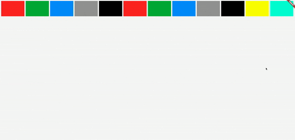

# Responsive Flex Grid

Flutter package to create Responsive Grid Design like Bootstrap.


- Adding Grid Items with weighted width
- Adding weighted width for xs: Extra Small, sm: Small, mb: Medium, lg: Large, xl: Extra Large, xxl: Extra Extra Large Devices
- Adding Padding between Grid Items



# Usage

Use `ResponsiveGrid` Widget to create Responsive Grid, Append `ResponsiveGridItem` as children

```dart
ResponsiveGrid(
    gridSpacing: 8,
    children: [
      ResponsiveGridItem(
        child: _buildColorContainer(Colors.red),
        xs: 50,
        sm: 60,
        md: 70,
        lg: 80,
        xl: 90,
        xxl: 100,
      ),
      ResponsiveGridItem(
        child: _buildColorContainer(Colors.green),
        xs: 50,
        sm: 60,
        md: 70,
        lg: 80,
        xl: 90,
        xxl: 100,
      ),
      ResponsiveGridItem(
        child: _buildColorContainer(Colors.blue),
      ),
      ResponsiveGridItem(
        child: _buildColorContainer(Colors.grey),
      ),
      ResponsiveGridItem(
        child: _buildColorContainer(Colors.black),
      ),
      ResponsiveGridItem(
        child: _buildColorContainer(Colors.red),
      ),
      ResponsiveGridItem(
        child: _buildColorContainer(Colors.green),
      ),
      ResponsiveGridItem(
        child: _buildColorContainer(Colors.blue),
      ),
      ResponsiveGridItem(
        child: _buildColorContainer(Colors.grey),
      ),
      ResponsiveGridItem(
        child: _buildColorContainer(Colors.black),
      ),
      ResponsiveGridItem(
        child: _buildColorContainer(Colors.yellowAccent),
      ),
      ResponsiveGridItem(
        child: _buildColorContainer(Colors.tealAccent),
      ),
    ]
```
# TODO:

- [x] Responsive Grid
- [x] Responsive Grid Item
- [x] Grid Item weight for Different Screens
- [x] Grid Item Padding
- [x] Mobile, Web, Widows, Linux, MacOS Support
- [ ] Adding LICENSE 
- [ ] Adding CONTRIBUTING 
- [ ] Adding ISSUE_TEMPLATE 
- [ ] Example Responsive Website 
- [ ] Creating Release v1.0.0
- [ ] Grid Animation
