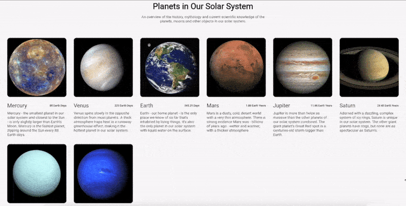

[](https://celestialsys.com)

# Flutter Responsive Flex Grid 

[](https://github.com/CelestialSystem/ResponsiveFlexGrid-Flutter/actions/workflows/ci-cd.yml)

Flutter package to create Responsive Grid Design like Bootstrap.


- Adding Grid Items with weighted width
- Adding weighted width for xs: Extra Small, sm: Small, mb: Medium, lg: Large, xl: Extra Large, xxl: Extra Extra Large Devices
- Adding Padding between Grid Items




# Installation
Use this package as a library

Depend on it

Run this command:

With Flutter:
```dart
$ flutter pub add flutter_responsive_flex_grid
```

This will add a line like this to your package's pubspec.yaml (and run an implicit dart pub get):
```dart
dependencies:
  flutter_responsive_flex_grid: ^0.0.1
```
Alternatively, your editor might support flutter pub get. Check the docs for your editor to learn more.

Import it
Now in your Dart code, you can use:
```dart
import 'package:flutter_responsive_flex_grid/flutter_responsive_flex_grid.dart';
```


# Usage

Use `ResponsiveGrid` Widget to create Responsive Grid, Append `ResponsiveGridItem` as children

```dart
ResponsiveGrid(
    gridSpacing: 8,
    children: [
      ResponsiveGridItem(
        child: _buildColorContainer(Colors.red),
        xs: 50,
        sm: 60,
        md: 70,
        lg: 80,
        xl: 90,
        xxl: 100,
      ),
      ResponsiveGridItem(
        child: _buildColorContainer(Colors.green),
        xs: 50,
        sm: 60,
        md: 70,
        lg: 80,
        xl: 90,
        xxl: 100,
      ),
      ResponsiveGridItem(
        child: _buildColorContainer(Colors.blue),
      ),
      ResponsiveGridItem(
        child: _buildColorContainer(Colors.grey),
      ),
      ResponsiveGridItem(
        child: _buildColorContainer(Colors.black),
      ),
      ResponsiveGridItem(
        child: _buildColorContainer(Colors.red),
      ),
      ResponsiveGridItem(
        child: _buildColorContainer(Colors.green),
      ),
      ResponsiveGridItem(
        child: _buildColorContainer(Colors.blue),
      ),
      ResponsiveGridItem(
        child: _buildColorContainer(Colors.grey),
      ),
      ResponsiveGridItem(
        child: _buildColorContainer(Colors.black),
      ),
      ResponsiveGridItem(
        child: _buildColorContainer(Colors.yellowAccent),
      ),
      ResponsiveGridItem(
        child: _buildColorContainer(Colors.tealAccent),
      ),
    ]
```

